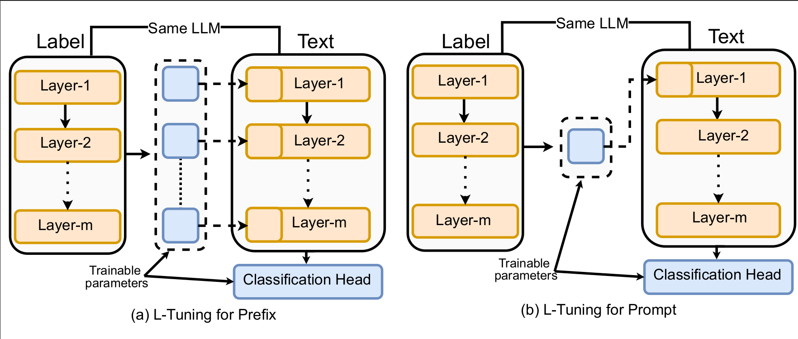
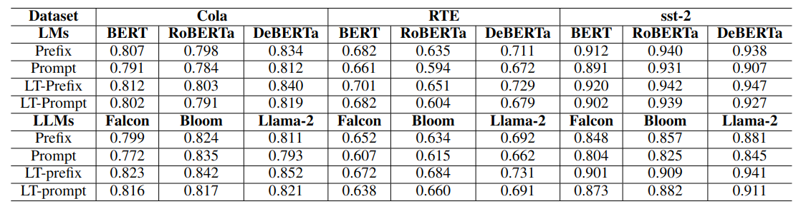

# L-Tuning


# Project Description

Efficiently fine-tuning Large Language Models (LLMs) for specific tasks presents a considerable challenge in natural language processing. Traditional methods, like prompt or prefix tuning, typically rely on arbitrary tokens for training, leading to prolonged training times and generalized token use across various class labels. To address these issues, this paper introduces L-Tuning, an efficient fine-tuning approach designed for classification tasks within the Natural Language Inference (NLI) framework. Diverging from conventional methods, L-Tuning focuses on the fine-tuning of label tokens processed through a pre-trained LLM, thereby harnessing its pre-existing semantic knowledge. This technique not only improves the fine-tuning accuracy and efficiency but also facilitates the generation of distinct label embeddings for each class, enhancing the model's training nuance. Our experimental results indicate a significant improvement in training efficiency and classification accuracy with L-Tuning compared to traditional approaches, marking a promising advancement in fine-tuning LLMs for complex language tasks.

Code is available at: [https://github.com/Kowsher/L-Tuning](https://github.com/Kowsher/L-Tuning).



*Figure 1: Methodology overview illustrating the L-Tuning approach.*

## Experiments 



*Figure 2: Comparative analysis of model performance across various input methodologies.*


The table presents a comparative analysis of pre-trained LMs (base model) and LLMs (7 billion model) across various input methodologies — Prefix, Prompt, LT-prefix, and LT-prompt. The highlighted performance metrics are accuracy scores for each combination of the model and dataset, illustrating the efficacy of each input methodology in enhancing model performance.


## Citation

If you use this code or the obtained results in your work, please cite this project as:

```
@inproceedings{kowsher-etal-2023-contrastive,
    title = "Contrastive Learning for Universal Zero-Shot {NLI} with Cross-Lingual Sentence Embeddings",
    author = "Kowsher, Md  and
      Sobuj, Md. Shohanur Islam  and
      Prottasha, Nusrat Jahan  and
      Arefin, Mohammad Shamsul  and
      Morimoto, Yasuhiko",
    editor = "Ataman, Duygu",
    booktitle = "Proceedings of the 3rd Workshop on Multi-lingual Representation Learning (MRL)",
    month = dec,
    year = "2023",
    address = "Singapore",
    publisher = "Association for Computational Linguistics",
    url = "https://aclanthology.org/2023.mrl-1.18",
    pages = "239--252",
}
```
